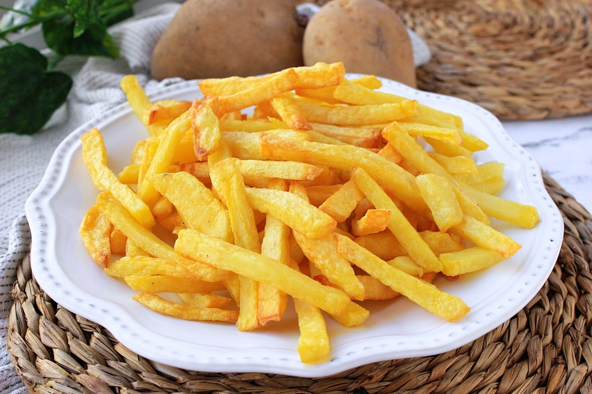

# Patatas fritas

Receta de patatas fritas caseras.

## Ingredientes

- 3 o 4 patatas (300g.)
- 4 dientes de ajo
- Aceite de oliva
- Sal
  
- ## Elaboración (Pasos)

1. Calentar aceite en una sartén.
2. Añadir las patatas cortadas, la sal y los ajos.
3. Freír al gusto.
4. Servir en plato.

---
